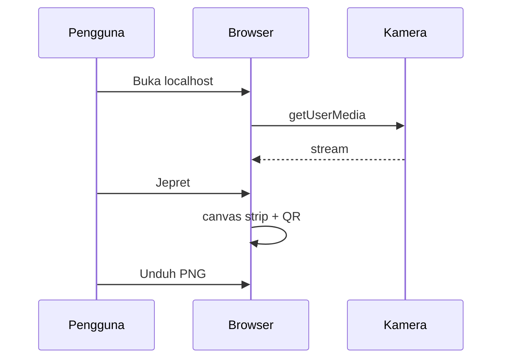

# Booth

## Overview

Photobooth di browser, jalan di laptop. Masalah: photobooth biasa butuh aplikasi berat. Tujuan: jepret, susun strip, tempel stiker, unduh gambar. Foto tidak dikirim ke server.

## Requirements

- Kamera lewat izin browser. Butuh `http://localhost`, bukan file langsung.
- Satu orang di laptop ini. Dua kamera = dua webcam di laptop yang sama.
- Tidak ada akun, tidak ada database, tidak ada simpan foto di disk kecuali yang pengguna unduh sendiri.
- Teks UI bahasa Indonesia. Nama filter merek tetap (iPhone, Fujifilm, Sony, Canon).

## Core Features

1. Satu kamera: hitung mundur per jepretan (3 detik, atau 5), suara, flash.
2. Bentuk strip: vertikal, kotak, couple, ulang tahun, 4 pose.
3. Filter warna: iPhone, Fujifilm, Sony, Canon.
4. Setelah jepret: crop (zoom dan geser, plus crop ketat), stiker, rasio unduh (asli, 9:16, 4:5, 1:1).
5. Di strip: nama booth, tanggal, QR ke tautan yang diisi.
6. Dua webcam: tiap jepretan jadi satu baris dua foto.

## User Flow

1. Pilih mode, bentuk, timer, filter, nama.
2. Buka kamera, izinkan.
3. Jepret. Hitung mundur jalan sendiri sampai jumlah foto cukup.
4. Atur crop dan stiker.
5. Unduh PNG.
6. Ganti sesi mematikan lampu kamera.

## Architecture

Browser saja. `index.html` + `app.js` + `vendor/qrcode.min.js`. Tidak ada request foto ke luar.

## Database Schema

Tidak ada. Foto tinggal di memori tab sampai diunduh atau tab ditutup.

## Design dan batasan teknis

HTML + CSS + JS polos. Tanpa React, tanpa backend.

Huruf: Segoe UI / system-ui. Bukan font dari internet, supaya tetap jalan offline setelah QR library ada di folder.

Dua HP beda kota tidak masuk di versi ini. Itu butuh kamar jaringan. Nyalakan kalau mode dua webcam di satu laptop sudah dipakai.
