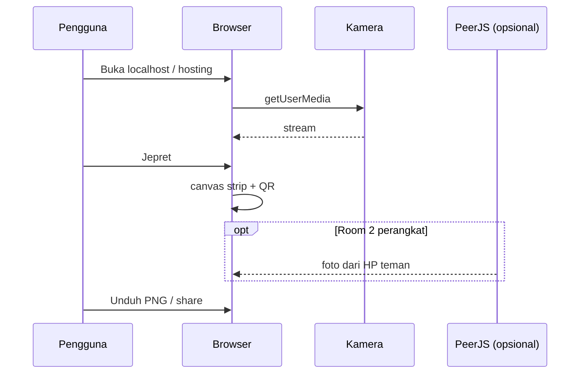

# Booth

## Overview

Photobooth di browser, jalan di laptop maupun HP. Masalah: photobooth biasa butuh aplikasi berat. Tujuan: jepret, susun strip, tempel stiker, unduh gambar. Foto tidak dikirim ke server.

## Requirements

- Kamera lewat izin browser. Butuh `http://localhost` atau HTTPS, bukan file langsung.
- Satu perangkat atau room dua perangkat: HP teman gabung lewat kode room (PeerJS), fotonya nyatu ke strip layar utama.
- Dua webcam di satu laptop = toggle "2 Webcam" — tiap jepretan jadi satu baris dua foto. Fallback ke 1 kamera kalau webcam kedua tidak ada.
- Tidak ada database milik booth. Galeri & sesi disimpan lokal di browser (IndexedDB + localStorage). Foto hanya keluar dari perangkat kalau pengguna unduh/share sendiri.
- Login/register akun bersifat opsional (Supabase). Tanpa env Supabase, aplikasi tetap jalan penuh — auth hanya disembunyikan.
- Teks UI bahasa Indonesia, ada toggle EN. Nama filter merek tetap (iPhone, Fujifilm, Sony, Canon).

## Core Features

1. Kamera: hitung mundur otomatis (1/3/5/10 dtk), suara, flash, mirror yang konsisten sampai hasil jepret, rasio 4:3/1:1/9:16, pilih device.
2. Bentuk strip: vertikal, grid, couple, ulang tahun, polaroid, komik, buah, pelangi, leopard, minimal + frame PNG custom.
3. Filter warna: iPhone, Fujifilm, Sony, Canon (36+ preset) + slider kekuatan.
4. Setelah jepret: crop (zoom scroll/cubit, geser, klik tukar urutan), stiker (drop, skala, putar, flip), teks, coret-coret, soft glow retouch, undo/redo (U/R/Ctrl+Z).
5. Di strip: nama booth + event, tanggal, QR ke tautan (default URL situs).
6. Room 2 perangkat: host bikin kode, tamu join (tombol atau `?room=KODE`), kirim foto live, kirim strip jadi.
7. Ekspor: PNG, JPEG, copy clipboard, Web Share API (fallback link WA/TG/X), cetak, video WebM animasi.
8. Galeri lokal (IndexedDB, blobs), autosave sesi edit, statistik jepret, onboarding, PWA offline.

## User Flow

1. Landing → pilih template (bisa cari & favorit) → Mulai Jepret atau Unggah Foto.
2. Pilih mode: 1 perangkat / 2 perangkat (room).
3. Buka kamera, izinkan. Pilih filter, timer, rasio.
4. Jepret. Hitung mundur jalan sendiri sampai jumlah foto cukup.
5. Studio: atur crop, stiker, teks, warna, retouch lewat tab panel.
6. Unduh PNG/JPEG, bagikan, atau kirim ke room.
7. Ganti sesi / "Sesi Baru" mematikan lampu kamera.

## Architecture

React + Vite (`photobooth-web/`). Foto tetap di memori browser; tidak ada request foto ke server sendiri.

```mermaid
sequenceDiagram
  participant U as Pengguna
  participant B as Browser
  participant C as Kamera
  participant P as PeerJS (opsional)
  U->>B: Buka localhost / hosting
  B->>C: getUserMedia
  C-->>B: stream
  U->>B: Jepret
  B->>B: canvas strip + QR
  opt Room 2 perangkat
    P-->>B: foto dari HP teman
  end
  U->>B: Unduh PNG / share
```

Modul: `src/App.jsx` (UI/state), `src/booth.js` (data template/filter/geometry), `src/draw.js` (render strip), `src/supabase.js` (auth opsional), `src/lib/*` (camera, sound, strip, gallery, session).

## Database Schema

Tidak ada database server wajib. Lokal: IndexedDB `kentamal-gallery` (store `shots`: id, blob, name, date) dan localStorage key `kentamal-*` (favs, session, frame, theme, lang, stats, seen). Supabase hanya dipakai untuk akun bila dikonfigurasi.

## Design dan batasan teknis

React 19 + Vite 6, tanpa UI framework. QR library lokal (`qrcode.min.js`). Font Chillax via fontshare dengan fallback Segoe UI/system (sudah di-cache SW untuk offline).

Mode terang = default; mode gelap tersedia lewat toggle (disimpan). Lihat DESIGN.md.
